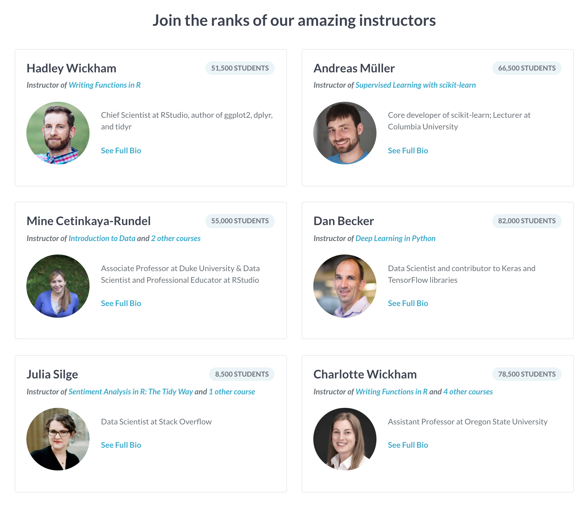

# How is content created at DataCamp? The team behind the screen

A decision was made early in [DataCamp's history](https://www.datacamp.com/about) to outsource our instructors so we can attract the best talent and build as many high-quality courses and projects as quickly as possible. DataCamp [instructors](https://www.datacamp.com/create) -- _academics, data scientists in industry, and open-source software developers, among others_ -- are hired on a part-time, contract basis that allows them to retain all of the intellectual property and earn a royalty based on student completions. This is great for everyone involved -- instructors, students, and DataCamp.

Do you ever wonder how these instructors go about creating their courses and projects, though? If you think it would be difficult to create a consistent learning experience with instructors that have all different kinds of backgrounds, _you're right_. An academic's instincts for creating content are different than an industry expert's are different than an open-source software developer's. There are also cultural, generational, and programming language backgrounds to consider.

To solve this problem, DataCamp has a Content team in-house comprised of **Instructor Recruiters, Curriculum Leads, Content Developers,** and **Content Quality Analysts.** Here's what each of those roles entails.

_If you're interested in becoming an instructor, you can apply [here](https://boards.greenhouse.io/datacamp/jobs/1267314) for courses and [here](https://boards.greenhouse.io/datacamp/jobs/1289131) for projects._

## Instructor Recruiter

DataCamp instructors are subject matter experts with a passion for teaching, excellent communication skills, and a strong network of their own. If someone in the community fits this profile, it is the Instructor Recruiter's job to make sure they know who we are and why they should consider working with us. If their skills align with our current curriculum goals, an Instructor Recruiter invites them to apply for an instructor role, leads them through the application process, and assesses their application alongside our Curriculum Leads. Once approved, they also guide instructors through our contracting and onboarding processes.

Meet [Jen](https://www.linkedin.com/in/brickerjennifer/), an Instructor Recruiter at DataCamp.

## Curriculum Lead (CL)

Once a contract is signed and onboarded with the help of one of our Instructor Recruiters, instructors are handed off to one of our Curriculum Leads (CL). The CL's primary responsibility is to work closely with instructors to create detailed specifications for new courses. The initial planning phase, if you will. They train instructors on our state-of-the-art authoring tools and best practices, as well as set and hold instructors accountable for deliverable deadlines. A typical day for a CL is filled with check-ins with instructors as they manage 15-20 courses at a time.

A CL also owns the data science curriculum roadmap for their portion of the curriculum (Python, R, SQL, Spreadsheets, etc.) and uses internal and external data to make informed curriculum decisions.

<iframe src="https://streamable.com/s/wvuua/aixcru" frameborder="0" width="100%" height="100%" allowfullscreen style="width:100%;height:100%;position:absolute;left:0px;top:0px;overflow:hidden;"></iframe>

Meet [Chester](https://www.linkedin.com/in/chesterismay), [Hillary](https://www.linkedin.com/in/hillary-green-lerman-39894b18/), and [Mona](https://www.linkedin.com/in/mona-khalil/), Curriculum Leads for courses.

## Content Developer (CD)

Following the Curriculum Lead's initial planning phase, it is the responsibility of the Content Developer (CD) lead instructors through the course development process from post-planning to launch. Their first touch point with instructors is to provide critical feedback on course specifications. CDs then act as reviewers, thought partners, and (most importantly) advocates for our students. They are the main source of review on the text and code our instructors write, delivering feedback, primarily in writing via [GitHub Issue](https://guides.github.com/features/issues/), to make courses as interactive and engaging as possible. They keep their 15-20 instructors on schedule and act as a director during the filming of their course's videos.

CDs also write automated tests in Python and R to provide personalized feedback for students and make data-driven suggestions for course improvements based on student feedback and engagement data.

Meet [Adrián](https://www.linkedin.com/in/adrian-soto/), [Amy](https://www.linkedin.com/in/amy-peterson-6143ba137/), [Becca](https://www.linkedin.com/in/beccarobins/), [David](https://www.linkedin.com/in/dcamposliz/), [Hadrien](https://www.linkedin.com/in/hadrienlacroix/), [Sara](https://www.linkedin.com/in/sarabillen/), and [Sumedh](https://www.linkedin.com/in/psumedh/), Content Developers, and [Yashas](https://www.linkedin.com/in/yashasroy/), Content Development Lead at DataCamp.

## Content Quality Analyst

DataCamp prides itself on having the best quality data science curriculum around. The Content Quality team makes sure that statement stays true. A Content Quality Analyst's role is to work with our instructors to maintain and improve their content, based upon feedback from students and course performance data. They review text and code to ensure they are high quality, and write new automated tests in Python and R to provide personalized feedback for students.

Meet [Richie](https://www.linkedin.com/in/richierocks/) and [Kaelen](https://www.linkedin.com/in/kaelen-medeiros-b0aab547/), Head of Content Quality and Content Quality Analyst.

## The Practice Team

[Practice](https://www.datacamp.com/community/blog/practice-mode-arrives-on-mobile) at DataCamp lives in the browser and in a mobile app, where you **Practice** the skills you **Learned** in courses. Practice is a relatively new product at DataCamp with one Curriculum Lead that performs all of the roles above.

## The Projects Team

[DataCamp projects](https://www.datacamp.com/projects) are where you **Apply** the several of skills you Learned in courses in a real-world, end-to-end data analysis. Like mobile, the projects team is currently a team of one: a Curriculum Lead that performs all of the roles above.

Meet [David](https://www.linkedin.com/in/davidventuri/) (me!), Curriculum Lead for projects.

## Leadership

Though instructors tend to not interact with them, the Content team is fearlessly lead by a Curriculum Director and a VP of Content. Meet [Mari](https://www.linkedin.com/in/mari-nazary/) and [Martijn](https://www.linkedin.com/in/martijn-theuwissen-b569b933/) (who is also a co-founder of the company).

**And that's the team!** Because of these folks, instructors get first-class treatment as they are guided through the content creation process. For more information on the benefits of becoming an instructor, read the FAQs [here](datacamp.com/create). If you want to become an instructor, apply [here](https://boards.greenhouse.io/datacamp/jobs/1267314) to create a course and [here](https://boards.greenhouse.io/datacamp/jobs/1289131) to create a project.

_DataCamp's [Learn, Practice, Apply](https://www.datacamp.com/community/blog/datacamp-the-plan) philosophy._
